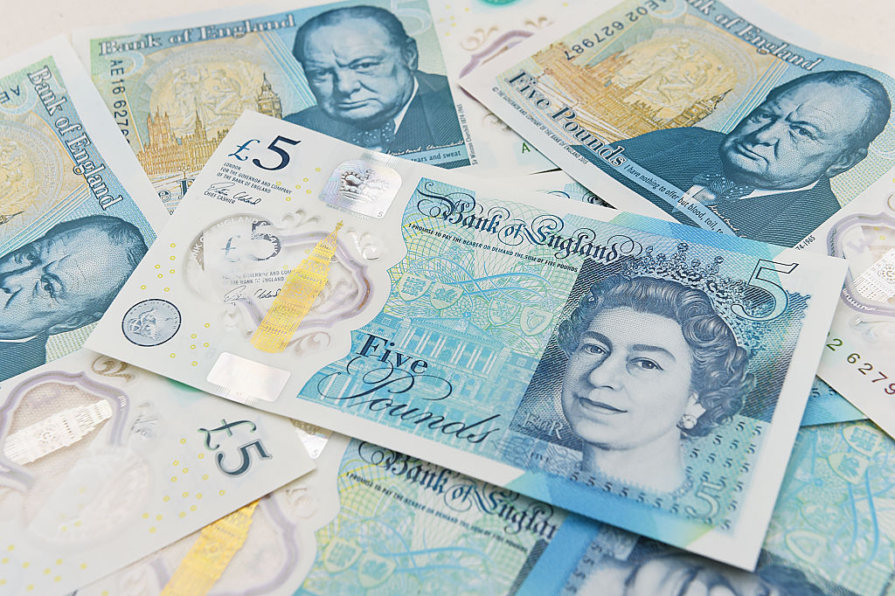

### 'Ello bruv, it's a splendid day innit 👋 ☕️ 🇬🇧

<!--
**Moneymoney122/Moneymoney122** is a ✨ _special_ ✨ repository because its `README.md` (this file) appears on your GitHub profile.

Here are some ideas to get you started:

- 🔭 I’m currently working on ...
- 🌱 I’m currently learning ...
- 👯 I’m looking to collaborate on ...
- 🤔 I’m looking for help with ...
- 💬 Ask me about ...
- 📫 How to reach me: ...
- 😄 Pronouns: ...
- ⚡ Fun fact: ...
-->

- I'm a british developer currently learning HTML, Python and Bash.

- I'm making some random things on here

- I'm currently working on: [boot-script](https://github.com/moneymoney122/boot-script), [repo](https://github.com/moneymoney122/repo) and [checkm8-usb](https://github.com/moneymoney122/checkm8-usb)

- Pronouns: he/him

- If you want to contact me, my preffered way is twitter: @chandler_hacker, or you could email me using the email on my profile.

- Fun fact: I use Arch Linux btw

- I like iOS Jailbreaking

- Headphone jack enjoyer

- My favourite colour is purple

- My website: https://clic.ly/moneymoney122

